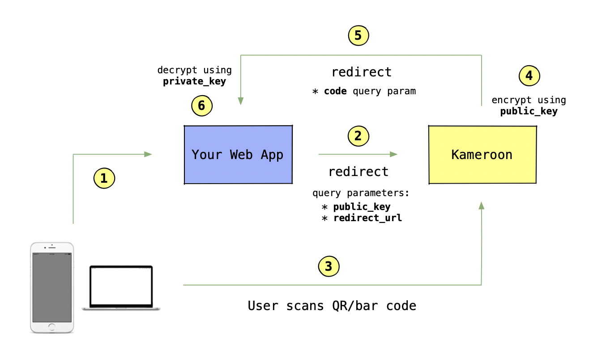

# 🇨🇲 Kameroon 🇨🇲
QR/bar code scanner as a Service

## 💡 Demo
* Scanner: https://kameroon.web.app
* React demo: https://kameroon-demo.web.app
* Pure JS demo: https://kameroon-demo-js.web.app

* **Simplicity**: No need for complex libraries. Just redirect users to [Kameroon](https://kameroon.web.app)
* **On-Device Scanning**: Scanning happens securely on your users' devices
* **Data Encryption**: Results never leave users' devices unencrypted. RSA-OAEP encryption is used with the `public_key` your provide
* **Secure Retrieval**: Encrypted data is sent back to your web app via the specified `redirect_url`
* **Client-Side Decoding**: Ciphertext is decoded using your `private_key`, which stays safely on your users' devices
* **Key Rotation**: Customize key rotation periods for enhanced security

## 🚀 Features
### Supported formats
* Linear product: UPC-A, UPC-E, EAN-8, EAN-13, ISBN
* Linear industrial: CODE-39, CODE-93, CODE-128, CODABAR, DATABAR, ITF-14, I25
* Matrix: QR code, Micro QR Code, Aztec, DataMatrix, PDF417

### Security
* In addition to using HTTPS, the resulting QR codes are further encrypted using asymmetric RSA-OAEP encryption to mitigate the risks associated with URL-based data transmission, including:
   - potential visibility in server logs and browser history
   - caching (some proxies and browsers might cache URLs, making your sensitive data accessible to others)
   - analytics tracking (if you're using analytics tools, they might capture query params, potentially exposing data you'd rather keep private)
   - server log exposure (server logs can sometimes include full URLs)
* Kameroon does not store your users' QR codes or encryption keys
* Encryption keys are rotated with customizable rotation periods (defaults to 1h) to align with user security policies

### Developer support
* [React.js](https://github.com/maslick/kameroon-demo) and [vanilla JS](https://github.com/maslick/kameroon-demo-js) examples
* Javascript helper [library ](https://github.com/maslick/kameroon-lib)

## 🔭 References
* https://github.com/maslick/koder
* https://github.com/maslick/kameroon-demo
* https://github.com/maslick/kameroon-demo-js
* https://github.com/maslick/kameroon-lib

## 🙏 Credits
We appreciate the open-source community for their contributions. **Kameroon** uses:

- [Zbar](https://github.com/mchehab/zbar) under [LGPLv2+](https://github.com/mchehab/zbar/blob/master/LICENSE.md)
- [ZXing-C++](https://github.com/zxing-cpp/zxing-cpp) (C++ port of ZXing) under [Apache License 2.0](https://github.com/zxing-cpp/zxing-cpp/blob/master/LICENSE)
